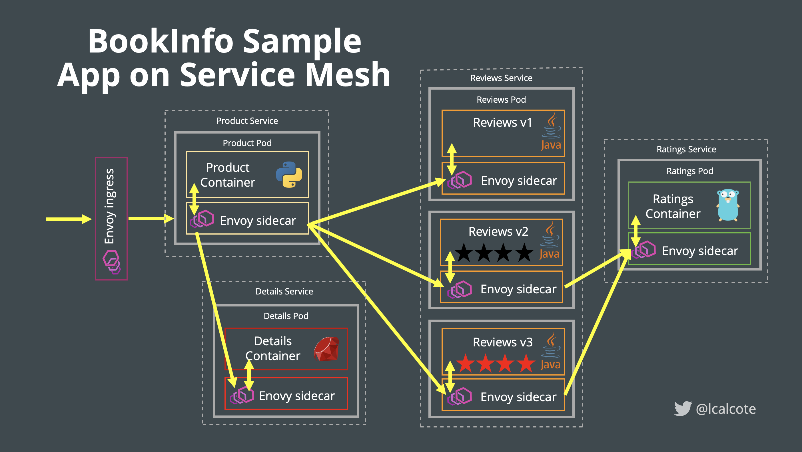

# LABS-04 - Istio Service Mesh - Setup BookInfo Application

[Main](../../README.md)

# Introduction 

A workshop on service mesh through the lens of Istio.

## Setup Istio
>As part of cf-for-k8s setup in previous lab we already installed Istio Service Mesh on the cluster.

To play with Istio and demonstrate some of it's capabilities, you will deploy the example BookInfo application, which is included the Istio package.

## What is the BookInfo Application?

This application is a polyglot composition of microservices are written in different languages.The end-to-end architecture of the application is shown in the figure.

<a href="img/bookinfo-off-mesh.png">

</a>

_Figure: BookInfo deployed off the mesh_

It’s worth noting that these services have no dependencies on Istio, but make an interesting service mesh example, particularly because of the multitude of services, languages and versions for the reviews service.

As shown in the figure below, proxies are sidecarred to each of the application containers.

<a href="img/bookinfo-on-mesh.png">

</a>

_Figure: BookInfo deployed on the mesh_

> Sidecars proxy can be either manually or automatically injected into the pods. Automatic sidecar injection requires that your Kubernetes api-server supports `admissionregistration.k8s.io/v1` or `admissionregistration.k8s.io/v1beta1` or `admissionregistration.k8s.io/v1beta2` APIs.

## <a name="auto"></a> Deploying Sample App with Automatic sidecar injection

Istio, deployed as part of this workshop, will also deploy the sidecar injector. Let us now create a namespace to deploy bookinfo application and verify sidecar injector.

```sh
kubectl create namespace bookinfo
```

```sh
kubectl get namespace -L istio-injection
```

Output:

```sh
NAME           STATUS    AGE       ISTIO-INJECTION
default        Active    1h        enabled
istio-system   Active    1h        disabled
kube-public    Active    1h
kube-system    Active    1h
```
### Label namespace for injection

 The default Istio installation uses automatic sidecar injection. Label the namespace that will host the application with istio-injection=enabled:

```sh
kubectl label namespace bookinfo istio-injection=enabled
```

### Deploy BookInfo

Applying this yaml file will deploy the BookInfo app in you cluster. The command launches all four services shown in the bookinfo application architecture diagram. All 3 versions of the reviews service, v1, v2, and v3, are started.

```sh
kubectl apply -f bookinfo.yaml -n bookinfo
```

Confirm all services and pods are correctly defined and running:

```sh
kubectl get services -n bookinfo
and 
kubectl get pods -n bookinfo
```

### Deploy Gateway and Virtual Service for BookInfo app

Virtual services, along with destination rules, are the key building blocks of Istio’s traffic routing functionality. A virtual service lets you configure how requests are routed to a service within an Istio service mesh, building on the basic connectivity and discovery provided by Istio and your platform. Each virtual service consists of a set of routing rules that are evaluated in order, letting Istio match each given request to the virtual service to a specific real destination within the mesh. Your mesh can require multiple virtual services or none depending on your use case.


We will leverage cf-system/istio-ingressgateway gateway we configured as part of TAS4K8s setup. 

```sh
kubectl apply -f virtual-service-productpage -n bookinfo
```

Confirm the app is accessible from outside the cluster

```sh
Kubectl get virtualservice -n bookinfo

NAME       GATEWAYS                             HOSTS                                        AGE
bookinfo   ["cf-system/istio-ingressgateway"]   ["productpage.workshop-01.frankcarta.com"]   71m
```

Access to http://productpage.workshop-01.frankcarta.com/productpage to view the Bookinfo web page.


### Traffic Policy 

 Routing rules are a powerful tool for routing particular subsets of traffic to particular destinations. You can set match conditions on traffic ports, header fields, URIs, and more.

If you refresh page multiple times you will see calls to reviews service, v1, v2, and v3. 

1. Define virtual servicve to route traffic for all services to v1 instances 

    ```sh
    kubectl apply -f virtual-service-all-v1.yaml -n bookinfo
    ```

    Refresh page and validate the change.


2. Transfer 50% of the traffic from reviews:v1 to reviews:v3

    ```sh
    kubectl apply -f virtual-service-reviews-50-v3.yaml -n bookinfo
    ```

3. Route traffic based of request header, This virtual service routes requests to different versions of a service depending on whether the request comes from a particular user

    ```sh
    kubectl apply -f virtual-service-reviews-header-v2 -n bookinfo
    ```
with this virtual service review v2 route is applyed to all requests from the user “jason” and all other will hit deployment v1 
    